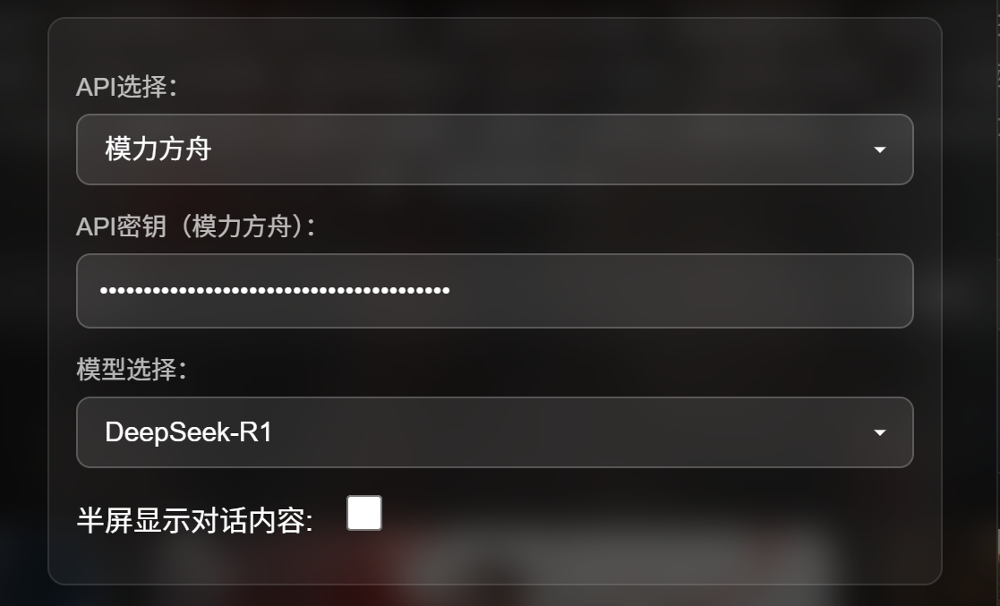

# 🎉青简问对 | 文脉千年待君询

#### 🎉集成模力方舟、DeepSeek、阿里云等API的AI聊天智能体开发框架

[](https://gitee.com/BambooScript-Dialogues/Dialogues-on-Bamboo-Slips/stargazers)
[](https://gitee.com/BambooScript-Dialogues/Dialogues-on-Bamboo-Slips/members)    

[](https://compass.gitee.com/analyze/smavl1ny)
[](https://compass.gitee.com/analyze/smavl1ny#collaboration_development_index)
[](https://compass.gitee.com/analyze/smavl1ny#community_service_support)
[](https://compass.gitee.com/analyze/smavl1ny#community_activity)
[](https://compass.gitee.com/analyze/smavl1ny#community_activity)

**青简问对 | 文脉千年待君询** 溯竹简之脉，赋 AI 以魂，此乃贯通古今的智能对话秘境。多角色模型如开卷见贤 —— 士人论道、墨客抒怀，皆从历史中撷取思想肌理，于数字空间重现百家争鸣之境。风格化应答重铸功能深研古典语体，使现代叩问可化《诗经》之清扬、汉赋之瑰丽、宋词之婉约。 于此，AI 非冰冷算法，而是携千年墨香的 “数字书僮”，以智能为舟，载用户横渡古今思想的沧波，在时光留白处谱就新的文明诗行。


## 项目简介


**青简问对**，乃沉浸式历史人物对话体验之平台也。君可与三十余位古今英杰（如霍去病、曹操、孔子等）畅谈古今，领略各家风采，感受千年智慧。平台集AI对话、语音合成、角色扮演于一体，支持多角色切换与花样互动，自称历史爱好者与AI体验者之乐园。  
> “与古人对话，何须青灯黄卷？一键唤醒，诸贤齐聚！” 😎📜

---

## 项目愿景

青简在手，千载如昨。我们希望用AI之力，复现历史人物的风采，让每一位用户都能与古人对话、与先贤论道。无论你是历史迷、文学控，还是AI技术爱好者，都能在此平台中找到属于自己的乐趣。  

> "青简一展，风云再起。与诸君共赏盛世繁华！"

**教学价值**：  
📚 历史课堂的延伸：提供沉浸式历史情境，学生可与历史人物"面对面"探讨决策得失  
🎭 角色代入学习：通过扮演不同历史角色，理解多元历史视角，培养共情能力  
💡 批判思维训练：在古今对话中辨析史料真伪，锻炼历史解释与实证能力  
🌍 文明互鉴平台：直观展现丝绸之路、唐蕃和亲等跨文化交流场景  
📊 数据史学实践：对话日志可转化为教学分析素材，观察历史认知形成过程  

--- 

## 主要功能


- **多角色扮演**：三十余位历史人物，皆有独特人设与语言风格，随时切换，体验“群英荟萃”。
  
  ```js
  // filepath: JavaScript/main.js
  if (path.includes('huoqubing')) {
      const huoqubing = new HuoQubing();
      huoqubing.init();
      window.currentCharacter = huoqubing;
  }
  // “大汉冠军侯，已就位！”
  ```

- **AI智能对话**：集成DeepSeek、通义千问、阿里云CosyVoice-v1、模力方舟等大模型API，妙语连珠，知无不言，支持上下文记忆。无论是问兵法、论诗词、谈人生，皆可对答如流。
  
  ```js
  // filepath: JavaScript/apiRequest.js
  export async function sendMessage(API_KEY, messageHistory, userInput, isRephrase, chatContainer, handleRephrase, callback) {
      // ...AI对话请求与回调...
  }
  // “AI小生，愿闻其详！”
  ```

- **语音合成**：每位角色皆有专属语音参数，阿里云TTS加持，闭眼聆听，仿佛古人亲临。曹操之雄浑、孔子之温雅、霍去病之英气，皆可耳闻。
  
  ```js
  // filepath: JavaScript/speechSynthesis.js
  export async function synthesizeSpeech(text, character = "默认") {
      // ...语音合成逻辑...
  }
  // “听君一席话，如闻古人声。”
  ```

- **历史对话记录**：自动保存每位角色的对话历史，断点续聊，往事如烟，随时翻阅。昨日之语，今日可续，前尘旧梦，一键重温。
  
  ```js
  // filepath: JavaScript/baseCharacter.js
  loadHistory() {
      const savedHistory = localStorage.getItem(`chatHistory_${this.name}`);
      // ...历史记录加载与恢复...
  }
  // “前尘旧梦，一键重温。”
  ```

- **界面自适应**：半屏/全屏随心切换，Windows端小窗大屏皆可畅聊，古今无界。无论案头小憩，还是夜深独坐，皆可与古人共话桑麻。
  
  ```js
  // filepath: JavaScript/messageHandler.js
  const halfScreen = localStorage.getItem('halfScreen') === 'true';
  if (halfScreen) {
      chatContainer.style.position = 'fixed';
      chatContainer.style.height = '50vh';
      // ...
  }
  // “小屏大屏，皆可容我三千言。”
  ```

- **丰富的交互体验**：AI回复可重述，预设选项、背景音乐、视频等多模态互动，花样百出，乐趣无穷。可一键重述AI回复，亦可随心切换古风BGM，仿佛置身盛世长安、江南水乡。
  
  ```js
  // filepath: JavaScript/messageHandler.js
  export function addRephraseButton(messageContainer, handleRephrase) { /* ... */ }

  // filepath: JavaScript/musicControls.js
  export function initMusicControls(characterName) { /* ... */ }

  // filepath: JavaScript/eventListeners.js
  export function createPresetButtons(pullUpMenu, options) { /* ... */ }
  // “一键重述，妙语连珠；乐声悠扬，古今同乐。”
  ```

- **自定义用户人设**：昵称、性别、人物设定随心定制，做自己的主角。你可化身少年游侠，亦可扮作巾帼英雌，与古人共书新篇。
- **多语言/多模态扩展**：后续可支持多语言、多模态输入输出，海纳百川，兼容并包。


---

## 文件结构

```
├─ JavaScript/                # 前端主要JS代码
│  ├─ main.js                 # 入口逻辑，角色切换
│  ├─ baseCharacter.js        # 角色基类，通用行为
│  ├─ speechSynthesis.js      # 语音合成与TTS参数
│  ├─ messageHandler.js       # 消息展示、按钮与交互
│  ├─ apiRequest.js           # 与后端/AI接口交互
│  ├─ eventListeners.js       # 事件绑定与UI逻辑
│  └─ ...                     # 其它功能模块
├─ characters/                # 各历史人物角色定义
│  ├─ 霍去病/huoqubing.js
│  ├─ 曹操/caocao.js
│  └─ ...                     # 其它角色
├─ assets/                    # 静态资源（图片、音频、视频等）
├─ Technical-documentation/   # 技术文档与开发说明
├─ README.md                  # 项目说明
└─ ...                        # 其它资源与文档
```

---

## 快速开始
#### 开发环境
1. **克隆本项目到本地**  
   `git clone <your-repo-url>`
2. **配置API密钥**  
   - 可在运行的端口中index.html中点击右上角的“ ⚙️ ”直接输入
3. **启动本地后端服务**（如有，详见Technical-documentation）
4. **用浏览器打开服务器端口**，选择角色即可体验沉浸式对话  
   > “一键穿越，古今同席！” 🕰️
#### 用户环境 ✔

1. **下载解压后双击打开”start.bat“**
2. **输入API密钥**右上角设置按钮



3. **编写自己的人设**，根据自己的喜好设置


4. **下滑到底部，点击”保存设置“**

5. **选择角色**，开始对话

---

## 主要依赖
- 模力方舟大模型API（AI对话）
- DeepSeek/通义千问等大模型API（AI对话）
- 阿里云语音合成TTS（角色语音）
- 原生JavaScript/ES6，无需第三方前端框架
- 可选：Node.js本地后端（如需自定义API代理）

---

## 角色扩展说明

- 在`characters/`目录下新增角色文件（如`李白/libai.js`），继承`BaseCharacter`并自定义人设、语音参数、风格等。
- 在`main.js`中引入新角色，并注册到角色切换逻辑中。
- 可为新角色配置专属TTS参数，实现个性化语音合成。
-  
  > “欲穷千里目，更上一层楼。——角色扩展，随心所欲！”

---

## 技术文档与开发说明

- `Technical-documentation/`目录下包含详细的开发计划、API对接说明、角色提示词工程、语音合成集成方案等文档。
- 推荐开发者先阅读相关文档，了解整体架构与扩展方式。
- 若有疑难，可翻阅文档，亦可“召唤”AI助手，答疑解惑。

---

## 常见问题

- **Q：为何语音合成声音相似？**  
  A：可在`speechSynthesis.js`中为每个角色分配不同的`voice_type`和参数，提升区分度。  
  > “一人千面，声声不同。”
- **Q：如何保存和恢复历史对话？**  
  A：项目自动将每个角色的对话历史保存在`localStorage`，切换角色时自动恢复。
- **Q：如何自定义用户人设？**  
  A：可在界面或`localStorage`中设置`userName`、`userGender`、`userPersona`等字段。
- **Q：为何AI偶有“失忆”？**  
  A：如遇上下文丢失，可刷新页面或重新加载历史，AI自会“忆起前尘”。
- **Q：能否让AI吟诗作对？**  
  A：当然！无论五言绝句、七律长歌，皆可一试，AI自会“出口成章”。

---

## 联系与贡献

如有建议、Bug反馈或希望参与开发，请联系项目维护者，或提交Issue/PR。  
亦欢迎各路豪杰共襄盛举，携手再现盛世风华！

---

> 本项目仅供学习与交流，严禁用于商业用途。
>
> “青简在手，古今任我游！”  

[](https://gitee.com/cnt-code/Dialogues-on-Bamboo-Slips)
> 若有一言不合，莫怪AI“穿越”失灵，且待诸君指正！😄📜
